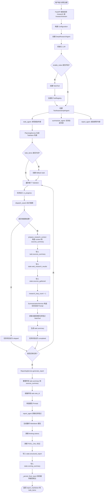
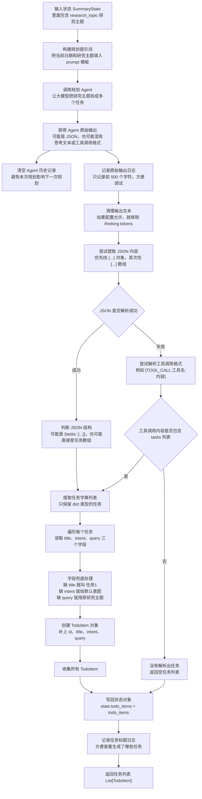
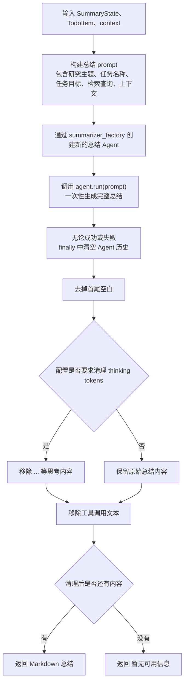

# 摘要
## 难点：
- 信息的不断发散
- 事实的快速更新
- 用户对引用来源的高要求
## 需要具备的能力：
- **问题剖析**：拆解用户意图为多个可检索的查询语句
- **多轮信息采集**：结合不同搜索API持续挖掘资料，并去重整合
- **反思与总结**：依据阶段结果识别知识空白，决定是否继续检索，并生成结构化总结。

# 项目概述与架构设计
## 为什么需要深度研究智能体？
### 传统研究方式的痛点：
- 信息过载
- 缺少结构——缺少系统性组织
- 重复劳动——每次研究新主题时，都需要重复"搜索→阅读→总结→整理"的过程
### 核心价值：
- 节省时间：将1-2小时研究工作压缩到5-10分钟
- 提高质量：系统化研究流程，避免遗漏重要信息
- 可追溯：记录所有搜索结果和来源，方便验证和引用
- 可扩展：可轻松添加搜索引擎、数据源和分析工具
## 技术架构
前后端分离
![[自动化深度研究智能体-1781706389443.webp]]

系统分为四层架构设计：

**前端层 (Vue3+TypeScript)**：全屏模态对话框 UI、Markdown 结果可视化

**后端层 (FastAPI)**：API 路由（`/research/stream`）

**智能体层 (HelloAgents)**：三个专门 Agent（TODO Planner、Task Summarizer、Report Writer）+ 两个核心工具（SearchTool、NoteTool）

**外部服务层**：搜索引擎+ LLM 提供商

## 完整流程：
1. **用户输入**：用户在前端输入研究主题
2. **前端发送**：前端通过 SSE 连接到`/research/stream`
3. **后端接收**：FastAPI 接收请求，创建研究状态
4. **规划阶段**：调用研究规划 Agent，分解为 3 个子任务
5. **执行阶段**：逐个执行每个子任务
    - 使用 SearchTool 搜索
    - 调用任务总结 Agent 总结
    - 使用 NoteTool 记录结果
6. **报告阶段**：调用报告生成 Agent，整合所有总结
7. **流式返回**：通过 SSE 推送进度和结果到前端
8. **前端展示**：前端实时更新任务状态、进度条、日志、报告

## 结构目录：
``` Markdown
helloagents-deepresearch/
├── backend/                    # 后端代码
│   ├── src/
│   │   ├── agent.py           # 核心协调器
│   │   ├── main.py            # FastAPI入口
│   │   ├── models.py          # 数据模型
│   │   ├── prompts.py         # Prompt模板
│   │   ├── config.py          # 配置管理
│   │   └── services/          # 服务层
│   │       ├── planner.py     # 规划服务
│   │       ├── summarizer.py  # 总结服务
│   │       ├── reporter.py    # 报告服务
│   │       └── search.py      # 搜索服务
│   ├── .env                   # 环境变量
│   ├── pyproject.toml         # 依赖管理
│   └── workspace/             # 研究笔记
│
└── frontend/                   # 前端代码
    ├── src/
    │   ├── App.vue            # 主组件
    │   ├── components/        # UI组件
    │   │   └── ResearchModal.vue
    │   └── composables/       # 组合式函数
    │       └── useResearch.ts
    ├── package.json           # npm依赖
    └── vite.config.ts         # 构建配置

```

## **TODO 驱动的研究范式**

我们提出了一种新的研究范式——TODO 驱动的研究。这种范式将复杂的研究主题分解为可执行的子任务，通过三个阶段完成研究：

- **规划阶段**：将研究主题分解为 3-5 个子任务，每个子任务包含标题、意图和搜索查询
- **执行阶段**：对每个子任务执行搜索和总结，生成结构化的知识
- **报告阶段**：整合所有子任务的总结，生成最终的研究报告

这种范式的优势在于：

1. **可控性强**：每个子任务都有明确的目标和范围
2. **质量可靠**：通过专门的 Agent 保证每个环节的质量
3. **易于调试**：可以单独调试每个子任务
4. **可扩展性好**：可以轻松添加新的子任务或修改现有子任务

## Agent 协作系统

我们设计了三个专门的 Agent，各司其职：

- **TODO Planner（研究规划专家）**：负责将研究主题分解为子任务
- **Task Summarizer（任务总结专家）**：负责总结每个子任务的搜索结果
- **Report Writer（报告撰写专家）**：负责整合所有子任务的总结，生成最终报告

这种设计的优势在于：

1. **职责清晰**：每个 Agent 专注于一个特定的任务
2. **Prompt 优化**：可以为每个 Agent 定制专门的 Prompt
3. **易于维护**：修改一个 Agent 不会影响其他 Agent
4. **质量保证**：每个 Agent 都是该领域的"专家"

## **ToolAwareSimpleAgent 的设计**

我们扩展了 HelloAgents 框架的`SimpleAgent`，实现了`ToolAwareSimpleAgent`。这个 Agent 具有工具调用监听能力，可以：

- **监听工具调用**：通过回调函数监听每次工具调用
- **实时反馈**：将工具调用信息实时推送给前端
- **调试支持**：记录所有工具调用，便于调试

这个 Agent 已经集成到 HelloAgents 框架中，可以在其他项目中复用。

## **工具系统集成**

我们充分利用了 HelloAgents 框架的工具系统：

- **SearchTool**：扩展支持更多种搜索引擎（Tavily、DuckDuckGo、Perplexity 等）
- **NoteTool**：持久化研究进度，支持恢复和审计
- **ToolRegistry**：统一管理所有工具，支持自定义扩展

通过配置化的设计，用户可以轻松切换搜索引擎，无需修改代码。

## **核心服务实现**

我们实现了四个核心服务，连接 Agent 和工具：

- **PlanningService**：调用规划 Agent，解析 JSON，验证格式
- **SummarizationService**：调用总结 Agent，处理搜索结果，提取来源
- **ReportingService**：调用报告 Agent，整合总结，生成报告
- **SearchService**：调度搜索引擎，处理结果，错误降级，结果缓存

这些服务各司其职，通过清晰的接口协作，实现了从研究主题到最终报告的自动化流程。

# 项目开发流程
## 1. 设计开发模块和架构图，进行技术选项

### 1.1. 整体设计
![[自动化深度研究整体设计模块.png]]
### 1.2. 完整流程

总结来说就是：
第一步，用户在前端输入研究主题。前端把主题和可选的搜索引擎类型发送给后端。如果使用 `/research/stream`，后端会以 SSE 的方式持续返回进度事件。

第二步，后端构建配置并初始化系统资源。`main.py` 根据请求和环境变量创建 `Configuration`，然后实例化 `DeepResearchAgent`。`DeepResearchAgent` 会创建共享的 `HelloAgentsLLM`，根据配置决定是否启用 `NoteTool`，如果启用笔记工具，就创建 `ToolRegistry` 并注册工具，同时创建 `ToolCallTracker` 监听工具调用。接着初始化规划 Agent、报告 Agent 和总结 Agent factory，再创建规划、总结、报告等服务对象。

第三步，进入规划阶段。系统创建 `SummaryState`，把用户输入写入 `state.research_topic`。然后调用 `PlanningService.plan_todo_list()`，由规划 Agent 根据主题生成多个结构化 TODO 任务。Prompt 会要求生成 3 到 5 个任务，每个任务包含 `title`、`intent` 和 `query`。代码层面会解析模型输出中的 JSON。如果没有解析到有效任务，会创建 fallback task，保证流程不中断。

第四步，进入任务执行阶段。`DeepResearchAgent` 会执行 `state.todo_items` 中的每个任务。在普通 `/research` 接口里，任务是顺序执行的；在 `/research/stream` 流式接口里，每个任务会启动一个 worker 线程并发执行，执行过程中产生的事件会通过 `Queue` 汇总，再统一推送给前端。每个任务开始时，状态会从 `pending` 变成 `in_progress`，然后系统根据 `task.query` 调用搜索模块。

第五步，进入搜索和单任务总结阶段。搜索模块根据配置选择搜索后端，返回搜索结果、来源摘要、可能的直接答案和提示信息。如果没有搜索结果，该任务会被标记为 `skipped`；如果有搜索结果，系统会把结果整理成两部分：一部分是给模型使用的 `context`，另一部分是给用户和报告使用的 `sources_summary`。随后 `SummarizationService` 会构造任务总结 Prompt，里面包含研究主题、任务标题、任务目标、搜索查询、搜索上下文和笔记协作指引。总结 Agent 基于这些信息生成 Markdown 总结，系统清理 `<think>` 和 `[TOOL_CALL:...]` 等内部标记后，把结果写回 `task.summary`，并把任务状态改成 `completed`。

第六步，进入最终报告阶段。所有子任务完成后，系统调用 `ReportingService.generate_report()`。这个服务会遍历所有 `TodoItem`，整理每个任务的标题、目标、查询、执行状态、任务总结和来源概览，同时收集任务笔记的 `note_id`。然后它构造最终报告 Prompt，交给报告 Agent。报告 Agent 综合所有任务摘要、来源信息和任务笔记，生成最终 Markdown 研究报告。最后 `DeepResearchAgent` 把报告写入 `state.structured_report` 和 `state.running_summary`，如果启用了笔记工具，还会把最终报告保存成报告笔记。后端再通过普通 HTTP 响应或 SSE 的 `final_report` 事件返回给前端。


### 1.2. Agent协作模式
由中央协调器调度生成子任务，再根据不同子任务对应顺序协作
![[自动化深度研究智能体-1781751696918.webp|697|697]]

#### 1.2.1. 任务规划服务


PlanningService 接收研究主题 → 构建 prompt → 调用 Agent 生成规划 → 解析 JSON 或工具调用格式 → 转成 TodoItem → 写回 SummaryState。
##### **规划质量评估**
需要放入：
TodoItem 生成完成之后
state.todo_items 写入之前
一个好的规划应该满足以下标准：
1. **覆盖全面**：涵盖主题的所有重要方面
2. **逻辑清晰**：子任务之间有明确的逻辑关系
3. **查询精准**：搜索查询能够准确找到相关资料
4. **数量适中**：3-5 个子任务

``` python
def evaluate_plan(self, todo_items: List[TodoItem]) -> dict:
    """评估规划质量

    Returns:
        评估结果，包含分数和建议
    """
    score = 100
    suggestions = []

    # 检查数量
    if len(todo_items) < 3:
        score -= 20
        suggestions.append("子任务数量过少，可能遗漏重要信息")
    elif len(todo_items) > 5:
        score -= 10
        suggestions.append("子任务数量过多，可能存在冗余")

    # 检查查询质量
    for task in todo_items:
        if len(task.query.split()) < 2:
            score -= 10
            suggestions.append(f"任务「{task.title}」的查询过于简单")

    # 检查逻辑关系
    # （这里可以添加更复杂的逻辑检查）

    return {
        "score": score,
        "suggestions": suggestions
    }

```

#### 1.2.2. 总结服务


#### 1.2.3. 报告生成服务
1. **格式化子任务总结**：将所有子任务的总结格式化为统一的格式
2. **构建报告 Prompt**：根据研究主题和子任务总结构建 Prompt
3. **调用报告 Agent**：调用 Report Writer Agent 生成最终报告
4. **整理引用**：将所有来源引用整理到参考文献部分


####  1.4. 搜索工具调用流程
![[自动化深度研究智能体-1781752033496.webp]]
**工具调用流程**：

1. **Agent 生成指令**：Agent 生成工具调用指令，如`[TOOL_CALL:search_tool:{"input": "Datawhale组织", "backend": "tavily"}]`**
2. **解析指令**：`ToolRegistry`解析指令，提取工具名称和参数
3. **查找工具**：`ToolRegistry`根据工具名称查找对应的工具
4. **调用工具**：调用工具的`run`方法，传入参数**
5. **返回结果**：工具返回执行结果**
6. **格式化结果**：将结果格式化为字符串，返回给 Agent


